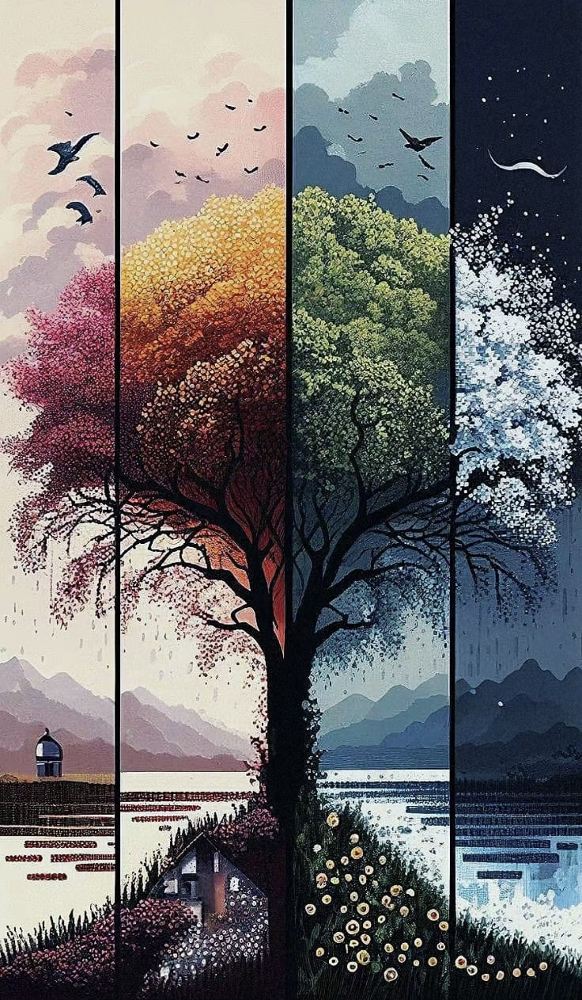

# sche0949_Major_Project

## Instructions

The work utilizes **Audio** to drive animation of ''Apple Tree''. 

The overall design follows the concept of the group project and is modified. The background color and the size of the apple can change with the calm and smooth piano music, showing that the apple is growing continuously in the changing seasons (represented by the background color). 

## Inspire Image

I chose images of trees and the changing seasons as the main source of inspiration. Since our group chose an apple tree, I wanted to make the tree and the background change with the peaceful piano music to show the season change, which creates a feeling of the passage of time.

## Instructions on how to interact

The interactive method of this work is that the music starts playing after clicking the play button, and the background color and the size of the apple start to change with the music. After clicking pause, it will stop at the previous screen and will not refresh. If you want to start again, you can refresh the page.

## Animation and difference

The difference between my work and the team member's mainly lies in the continuous animation expression（The animations of other members are performed in steps or end after a short duration）.
- The background color and the size of the apple change continuously
- In addition, the animation can follow the window resize

## Technical interpretation

### Setup
- **windowResized():** 
Resize the canvas and make all elements follow the window resize.

### Drawing:
- **draw():** 
Continuously called to draw, update elements, and render frames.
- **drawCanvas():** 
Draw the spectrum, fft, amplitude, background, oil painting, roots, bottom rectangle, branches and apple.

### Classes:

- **Branch:** Manages branch drawing and apples.
- **Apple:** Handles apple growth, falling, and drawing

### Preload:

- **LoadSound:** 
load the piano music.

### Play/Pause:

- **ToggleMusic:** 
Toggle between playing and pausing music.
- **if (isMusicPlaying) { ... } else { ... }:** 
Use an if statement to check if music is playing.
- **playButton.html('Play')/playButton.html('Pause'):** 
Set the play button's text to "Play"/"Pause".
- **pianoMusic.loop():** 
Start or continue looping music.
- **fft.setInput(pianoMusic):** 
When the music starts playing, set the input of the FFT to the currently playing music pianoMusic for frequency analysis.

### Audio Visualisation:

- **fft:** 
By analysing the audio signal,  the background color and the size of the apple change with the music.
- **lowFreqAmp,** 
  **midFreqAmp,** 
  **highFreqAmp** 
It is used to store the amplitude of the low, mid and high frequency band, different frequency bands will have different amplitudes, indicating the volume or intensity of the frequency band. This changes the background color and size.

## Change of code
- The main code changes are adding audio-related code (fft, amplitude, toggle music, etc.), play/pause buttons, and connecting the oil painting color, and size of an apple to the audio.
